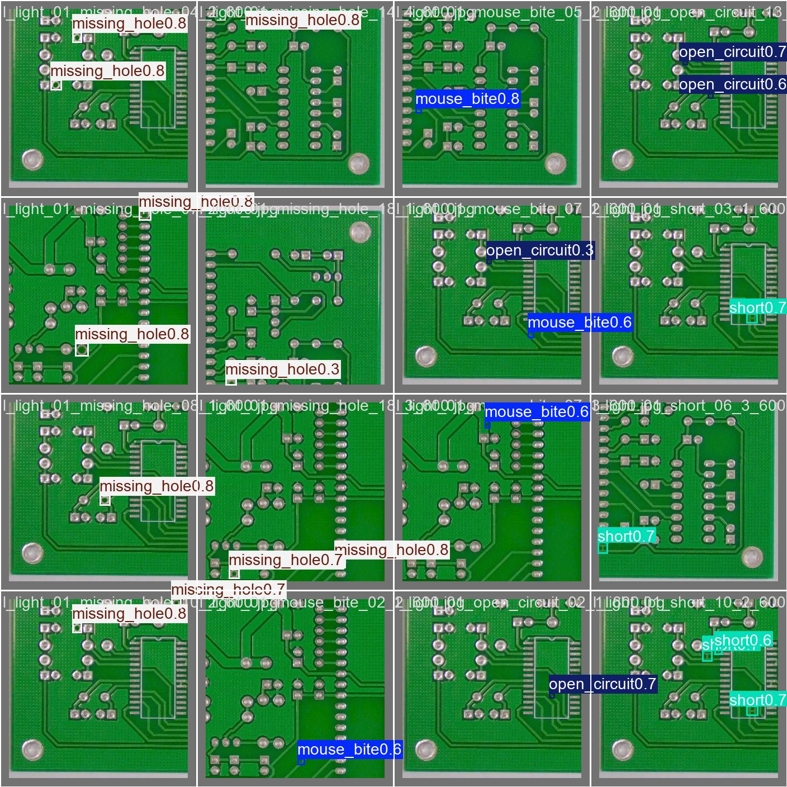

# Industrial PCB Defect Detection

An end-to-end YOLO11n object-detection system for locating manufacturing
defects in printed circuit board (PCB) images. The included Streamlit demo
accepts one or more images, visualizes bounding boxes, and exports results.

**Team & Roles**

| Role | Owner | Responsibility |
|---|---|---|
| Data Preparation & Dataset | Aya | Sourcing, cleaning, and splitting the dataset |
| Model Training & Evaluation | Heba | Training, evaluating, and selecting the final model |
| Application & Integration | Saif | Building the Streamlit app around the final model |

Detected defect classes:

| ID | Class |
|---:|---|
| 0 | mouse_bite |
| 1 | spur |
| 2 | missing_hole |
| 3 | short |
| 4 | open_circuit |
| 5 | spurious_copper |

---

## Project Structure

```text
PCB-Defect-Detection/
│
├── app/
│   └── app.py                     # Streamlit application (entry point)
│
├── model/
│   ├── best.pt                    # final trained YOLO11n weights
│   ├── model_config.yaml          # training configuration
│   ├── class_names.txt            # class ID -> name mapping
│   ├── evaluation_results.md      # metrics, confusion matrix, FP/FN analysis
│   ├── model_info.txt             # original quick-reference metrics
│   └── inference_instructions.md  # how to run inference with best.pt
│
├── src/
│   ├── inference.py                # model loading + prediction + box drawing
│   └── utils.py                    # small shared helpers
│
├── scripts/                        # dataset preparation scripts (Aya)
│   ├── dataset_summary.py
│   ├── dataset_audit.py
│   ├── check_duplicates.py
│   ├── analyze_duplicates.py
│   ├── check_visual_duplicates.py
│   └── clean_exact_duplicates.py
│
├── reprts/                         # dataset reports (legacy folder name)
│   ├── dataset_report.md
│   └── audit_result.txt
│
├── requirements.txt
├── CITATION.md                       # dataset source, acknowledgement, licence status
└── README.md
```

The cleaned `dataset_final/` folder is available locally for training and
evaluation. Final test-evaluation outputs are in `reports/model_evaluation/`.

> Note: the dataset is about 1.2 GB and should not be committed to a public Git
> repository. See `reprts/dataset_report.md` for its preparation process and
> statistics.

---

## Setup & Running the App

```bash
# 1. Clone the repository
git clone https://github.com/Aya-Waleed/Industrial-PCB-Defect-Detection.git
cd Industrial-PCB-Defect-Detection

# 2. Install dependencies
pip install -r requirements.txt

# 3. Run the app
streamlit run app/app.py
```

The app will open in your browser. Upload a PCB image and it will:
1. Run the trained model on the image.
2. Draw bounding boxes around detected defects.
3. Show defect type, confidence score, and location for each detection.
4. Display a clear "no defects detected" message if the board looks clean.

---

## Model Summary

- **Architecture:** YOLO11n (object detection, transfer learning)
- **Input size:** 320x320
- **Validation metrics:** final training epoch, saved in the checkpoint

| Metric | Value |
|---|---:|
| Precision | 0.9542 |
| Recall | 0.9313 |
| mAP50 | 0.9640 |
| mAP50-95 | 0.4789 |

Inference speed must be measured again on the actual demo/deployment machine:

```bash
python scripts/benchmark_inference.py
```

Do not quote a speed result from a different machine in the presentation.

Full verified evaluation details are generated from the final held-out dataset:

```bash
python scripts/evaluate_model.py --data dataset_final/data.yaml
```

This writes test-set per-class metrics, confusion matrices, curves and the
final report to `reports/model_evaluation/`. The command has been run on the
cleaned held-out split; see `model/evaluation_results.md` for the final summary.

### Held-out test results

| Precision | Recall | mAP50 | mAP50-95 |
|---:|---:|---:|---:|
| 0.7470 | 0.9156 | 0.7656 | 0.3670 |

The test result is intentionally reported separately from the checkpoint's
validation metrics above.

The app's sidebar displays these held-out test metrics, not the checkpoint's
validation values.

### Class-level findings

`missing_hole` has the strongest recall (0.9894). At the demo's default
confidence threshold of 0.25, `spurious_copper` produces the most false
positives (65); `mouse_bite` has the most false negatives (29). Full details
are in [the FP/FN analysis](reports/model_evaluation/fp_fn_analysis.md).

---

## Dataset Source

The prepared-data report identifies the source as Norbert Elter's **PCB Defect
dataset** on Kaggle. See [CITATION.md](CITATION.md) for the dataset link,
upstream acknowledgement, and the important license restriction: the source
page lists the license as *Unknown*, so raw images must not be redistributed
publicly without approval.

---

## Representative output

The test evaluation produces prediction/ground-truth samples in
`reports/model_evaluation/`. This representative prediction is generated from
the held-out test evaluation; it is not an external OOD result.



To capture a live application screenshot for a presentation, run the app and
upload an authorized image from `dataset_final/test/images` locally. Do not
commit the raw dataset because the source license is listed as Unknown.

---

## Testing

```bash
# Full pipeline smoke test (model loads, class names match, inference runs)
python tests/test_integration.py

# Inference speed benchmark
python scripts/benchmark_inference.py --n 30
```

The most recent local CPU benchmark is documented in
[reports/BENCHMARK.md](reports/BENCHMARK.md). Re-run it on the presentation
machine before quoting a speed figure.

## Improving the model

The checked-in `best.pt` is the submitted baseline. To improve strict box
localization (mAP50-95), run a separate 640px experiment on a GPU, then
evaluate it on the same held-out test split before replacing the baseline:

```bash
python scripts/train_model.py --data dataset_final/data.yaml --imgsz 640 --epochs 80 --device 0
python scripts/evaluate_model.py --weights runs/detect/yolo11n_640_experiment/weights/best.pt --data dataset_final/data.yaml
```

Do not report an improved mAP until the second command has completed and its
generated report has been reviewed.

See [CONTRIBUTING.md](CONTRIBUTING.md) for the team Git workflow and
[reports/FINAL_SUBMISSION_CHECKLIST.md](reports/FINAL_SUBMISSION_CHECKLIST.md)
for the final evidence checklist.

---

## Pipeline Overview

```text
Raw PCB Dataset
      │  (Aya)
      ▼
Cleaned, Split Dataset (dataset_final/)
      │  (Heba)
      ▼
Trained YOLO11n Model (best.pt)
      │  (Saif)
      ▼
Streamlit App (upload image → detect defects)
```

## Known Limitations

- Validation mAP50-95 (0.4789) is noticeably lower than validation mAP50
  (0.9640), meaning defects are
  reliably *found* but bounding-box localization is less precise at strict IoU
  thresholds — expected given how small most PCB defects are relative to image
  size.
- Per-class breakdown, confusion matrices, and thresholded false
  positive/negative analysis have been generated from the held-out test split;
  see `reports/model_evaluation/`.
- OOD robustness testing is pending real PCB images from a source outside the
  training dataset. Follow [reports/OOD_TESTING.md](reports/OOD_TESTING.md)
  rather than claiming an unperformed test.
